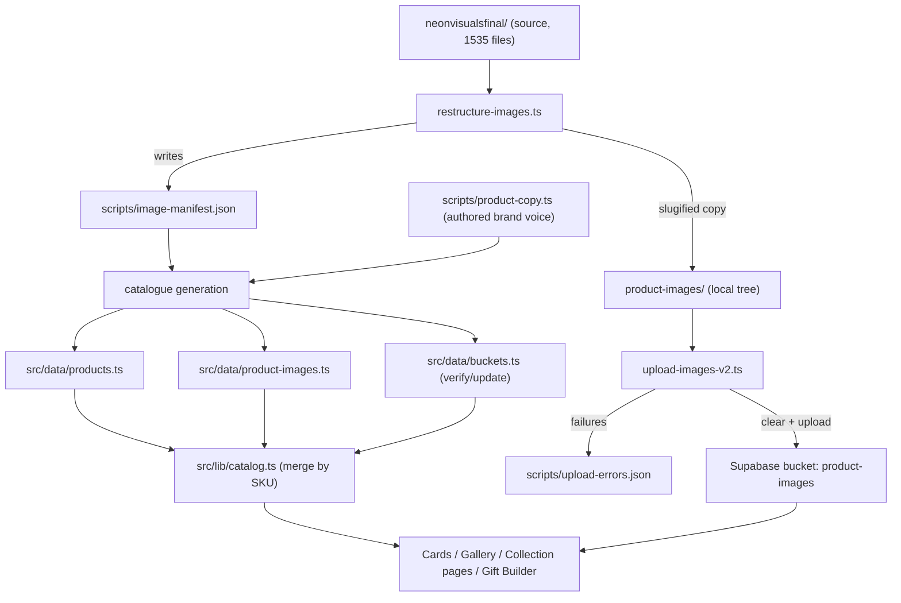

# Design Document

## Overview

This feature rebuilds the entire product image and catalogue data layer for neonvisuals.in from a new authoritative source folder (`neonvisualsfinal/`, 1,535 files across 382 folders). It is a four-stage pipeline plus a set of UI corrections:

1. **Restructure** (`scripts/restructure-images.ts`) — interpret the nested source folder, detect product-level folders, slugify every path segment, rebuild the local `product-images/` tree into a clean `<collection>/<product>/<variant>/<file>` shape, and emit `scripts/image-manifest.json`.
2. **Upload** (`scripts/upload-images-v2.ts`) — clear the Supabase `product-images` bucket, then upload the restructured tree preserving relative paths as object keys, with resilient batching and an error log.
3. **Catalogue generation** — regenerate `src/data/products.ts`, `src/data/product-images.ts`, and verify/update `src/data/buckets.ts` from the manifest, assigning deterministic SKUs (`NV-<LETTER>-<NNN>`), unique slugs, tags, flags, and merging authored premium brand-voice copy.
4. **UI corrections** — fix image presentation in the product card, product gallery, compact (gift-builder) card, collection page, and redesign the branded placeholder to a gift-icon on a warm neutral background.

The design is grounded in the code as it exists today. The public catalogue is served **statically** through `src/lib/catalog.ts`, which merges `PRODUCTS` (from `src/data/products.ts`) with `PRODUCT_IMAGES` (from `src/data/product-images.ts`) by SKU and joins collections from `src/data/buckets.ts`. No public page reads product or collection data from the Supabase database. Consequently the Part 8 database migration (Requirement 23) is scoped as **conditional and skippable** — see [Conditional Database Migration](#conditional-database-migration-requirement-23).

### Key grounding facts confirmed against the codebase

| Area | Reality in the code | Design consequence |
| --- | --- | --- |
| Data location | `src/data/{products,product-images,buckets}.ts` | All generation targets `src/data/` |
| Public data source | `src/lib/catalog.ts` merges static files by SKU; no DB reads | DB migration is skippable (Req 23.2) |
| Product type | `Product` in `src/lib/types/product.ts` uses `bucket`, `tagline`, `description`, `imageUrl`, `galleryImages`, `isFeatured`, `isBestseller`, `isNew`, internal `basePrice` | Only ADD optional `category`, `personalisation`, `milestone`; remove nothing |
| Current image map | `product-images.ts` uses stale `NV-A01/NV-A01_01.avif` layout | Fully regenerated to slug paths; stale layout forbidden (Req 24.5) |
| Route slugs | `buckets.ts` slugs are `welcome-onboarding`, `milestone-anniversary`, … (drive `/collections/[slug]` + `generateStaticParams`) | Route_Slug preserved; distinct from Storage_Slug |
| Script runner | Existing scripts are ESM `.mjs`; no `.ts` runner installed | Add `tsx` dev dependency + npm scripts (Req: tooling) |
| Image host | `next.config.ts` whitelists `xserhblhiwtmaiejbvgo.supabase.co` + `/storage/v1/object/public/product-images/**` | New slug-path URLs remain valid for `next/image`; no config change needed |
| Source folder | `neonvisualsfinal/` is not currently present at the root | Restructure script must fail fast with a descriptive error (Req 1.4) |

### Design decisions and rationale

- **Deterministic generation, authored copy.** Everything except brand-voice copy is derived deterministically from the manifest (identity, images, tags, flags, ordering). Premium taglines and descriptions (Requirement 11) cannot be produced deterministically at acceptable quality, so they are **authored into a keyed copy file** (`scripts/product-copy.ts`) and merged by SKU during generation, with a safe fallback for any missing key. This keeps generation reproducible while allowing human/LLM-assisted brand-voice copy. See [Catalogue Generation](#3-catalogue-generation).
- **Storage_Slug vs Route_Slug are distinct.** Storage paths use short slugs (`onboarding`, `milestone`, …) chosen for clean object keys; `/collections/[slug]` URLs keep the existing `buckets.ts` Route_Slugs so no public URL or `generateStaticParams` output changes.
- **Manifest is the single interchange format.** The restructure script writes `image-manifest.json`; both the upload step and the catalogue generator consume it. This decouples filesystem interpretation from data generation and makes the pipeline auditable.

## Architecture

### Pipeline



### Layering

- **Interpretation layer** (restructure script): pure folder-tree analysis + slugification + filesystem copy. The pure parts (slugify, product detection, path construction) are unit- and property-testable in isolation from the filesystem side effects.
- **Transport layer** (upload script): Supabase Storage side effects only. Not property-tested (external service) — verified with dry-run and integration checks.
- **Data layer** (`src/data/*` + `src/lib/catalog.ts`): static, typed, deterministic. Invariants over the generated data are property-testable.
- **Presentation layer** (components + pages): server components by default, one client island (`product-gallery.tsx`). Verified with example/snapshot-style checks and the build.

### Execution model

Scripts are run manually by the maintainer, in order, via npm scripts. They are one-shot operational tools, not part of the request/response path. `tsx` is added as a dev dependency to execute the TypeScript scripts (the existing `.mjs` scripts remain but are superseded by the v2 pipeline).

```
npm run restructure-images        # neonvisualsfinal/ -> product-images/ + image-manifest.json
npm run upload-images -- --dry-run # preview clear + upload counts
npm run upload-images             # clear bucket, upload tree, write upload-errors.json
# (catalogue generation — see Catalogue Generation section for the chosen mechanism)
npm run build                     # verify
```

## Components and Interfaces

### 1. Restructure script (`scripts/restructure-images.ts`)

Run via `npm run restructure-images`. Rebuilds the local `product-images/` tree and writes the manifest.

#### Collection mapping table (Requirement 1)

A fixed, exhaustive lookup keyed by the exact top-level source folder name:

```ts
interface CollectionMap {
  letter: BucketCode;      // "A".."K"
  storageSlug: string;     // used only in storage paths
  displayName: string;
}

const COLLECTION_MAP: Record<string, CollectionMap> = {
  "ON BOARDING KIT":                { letter: "A", storageSlug: "onboarding",      displayName: "Welcome & Onboarding" },
  "MILESTONE AND WORK ANNIVERSARY": { letter: "B", storageSlug: "milestone",       displayName: "Milestone & Anniversary" },
  "CEO & LEADERSHIP RECOGNITION":   { letter: "C", storageSlug: "ceo-leadership",  displayName: "CEO & Leadership Recognition" },
  "FESTIVE AND SEASONAL":           { letter: "D", storageSlug: "festive",         displayName: "Festive & Seasonal" },
  "CLIENT APPRECIATION":            { letter: "E", storageSlug: "client",          displayName: "Client Appreciation" },
  "EXPERIENCE KITS":                { letter: "F", storageSlug: "experience-kits", displayName: "Experience Kits" },
  "TECH AND DIGITAL FORWARD":       { letter: "G", storageSlug: "tech-forward",    displayName: "Tech-Forward & Digital" },
  "SUSTAINABILITY & ECO":           { letter: "H", storageSlug: "sustainability",  displayName: "Sustainability & Eco" },
  "EVENTS AND GENERAL GIFTS":       { letter: "I", storageSlug: "events",          displayName: "Events & General Gifts" },
  "college and events":             { letter: "J", storageSlug: "college",         displayName: "College Events" },
  "VISITING CARD":                  { letter: "K", storageSlug: "visiting-cards",  displayName: "Visiting Cards & Business Stationery" },
};
```

- Folder-name matching is done against the exact directory name. `ALL KITS` is handled specially as a Kit_Hero_Images source and is **not** a collection (Req 1.2).
- Any unmatched top-level folder that is not `ALL KITS` is logged and excluded (Req 1.3).
- If `neonvisualsfinal/` is absent, the script throws a descriptive error naming the missing folder and exits non-zero (Req 1.4).

#### Product-level detection algorithm (Requirement 2)

A recursive classifier over the directory tree. Terminology: a directory has "image children" (files whose extension is an Image_Extension) and "subdir children".

```
detectProducts(dir, collectionLetter, tenure?):
  imageChildren = files in dir with Image_Extension
  subdirs       = immediate subdirectories of dir

  if subdirs is empty:
      # only images (or nothing) — Req 2.1
      if imageChildren is non-empty:
          emit ProductFolder(dir, variantSets = [], images = sorted(imageChildren))
      return

  if every subdir contains ONLY image files (no deeper subdirs):
      # variant-set product — Req 2.2
      variantSets = sorted(subdirs)
      emit ProductFolder(dir, variantSets, images = ordered images across variantSets)
      return

  # subdirs themselves contain subdirs — recurse deeper — Req 2.3
  for each subdir in sorted(subdirs):
      detectProducts(subdir, collectionLetter, tenure)
```

- Ordering is deterministic: directories and files are sorted with a stable locale-independent comparison before processing, so the manifest and generated catalogue are reproducible (supports Req 9.4, 13.3).
- For each detected Product_Folder the script records the collection letter, the product folder path, and the ordered list of Variant_Sets and image files (Req 2.4).
- **Milestone tenure (collection B, Req 3.4 / 15.2):** when the collection is `B`, the immediate subfolders `ONE YEAR` / `FIVE YEAR` / `TEN YEAR` are recognised as tenure segments. Detection recurses into the tenure folder, and the tenure (`one-year` | `five-year` | `ten-year`) is threaded through as a path segment inserted between the collection segment and the product segment, and recorded on the Product_Folder for later `milestone` inference.

#### Slugification (Requirement 4)

```ts
function slugify(segment: string): string {
  return segment
    .toLowerCase()
    .replace(/\s+/g, "-")        // spaces -> single hyphen
    .replace(/[^a-z0-9-]/g, "")  // strip anything outside [a-z0-9-]
    .replace(/-+/g, "-")         // collapse consecutive hyphens
    .replace(/^-+|-+$/g, "");    // trim leading/trailing hyphens
}

function slugifyFileName(name: string): string {
  const ext = extname(name);              // retained unchanged (Req 4.2)
  const base = name.slice(0, -ext.length);
  return `${slugify(base)}${ext.toLowerCase()}`;
}
```

- **Collision handling (Req 4.3):** within a single destination folder a `Set` of assigned names is maintained; if a slugified name already exists, a numeric suffix (`-2`, `-3`, …) is appended to the base name before the extension, and the collision is logged.

#### Local tree rebuild (Requirement 3)

1. Delete all contents of `product-images/` while preserving the folder itself (Req 3.1) — read entries and remove each child recursively rather than removing the root.
2. Copy each detected product image to `product-images/<storage-slug>/[<tenure>/]<product-slug>/[<variant-slug>/]<file>` (Req 3.2). The variant segment is omitted for flat products; the tenure segment appears only for collection B.
3. Preserve original extensions (Req 3.3).
4. On completion, log totals: folders processed, files copied, files skipped (split into `.mp4` skips vs other skips), and errors (Req 3.5, 6.3).

#### Special file handling (Requirement 6)

```ts
const IMAGE_EXT = new Set([".webp", ".jpg", ".jpeg", ".avif", ".png"]);
// .mp4 -> skip + log, counted separately (Req 6.1, 6.3)
// extension not in IMAGE_EXT and not .mp4 -> skip + log with extension (Req 6.2)
```

#### Outputs

- Rebuilt `product-images/` tree.
- `scripts/image-manifest.json` (see [Data Models](#image-manifest-schema-requirement-5)).
- Console summary with all counts.

### 2. Upload script (`scripts/upload-images-v2.ts`)

Run via `npm run upload-images` (add `-- --dry-run` for preview). Reuses the `.env.local` loader and Supabase service-role client pattern already proven in `scripts/upload_images.mjs`.

```ts
const BUCKET = "product-images";
const CLEAR_BATCH = 100;   // Req 7.2
const UPLOAD_BATCH = 10;   // Req 8.3
const BATCH_DELAY_MS = 200;
const CONTENT_TYPE: Record<string, string> = {
  ".webp": "image/webp", ".jpg": "image/jpeg", ".jpeg": "image/jpeg",
  ".avif": "image/avif", ".png": "image/png",
};
```

**Auth (Req 8.1):** load `SUPABASE_SERVICE_ROLE_KEY` and `NEXT_PUBLIC_SUPABASE_URL` from `.env.local` (same `loadEnv` helper as the existing script), create the client with `{ auth: { persistSession: false } }`.

**Clear phase (Req 7):**
- List all objects in the bucket recursively (paginate through folders).
- Delete in batches of 100 (Req 7.2).
- If a delete batch errors, record it and continue clearing (Req 7.4).
- If `--dry-run`, skip all deletes and only log the count that would be deleted (Req 7.3, 8.8).

**Upload phase (Req 8):**
- Walk the local `product-images/` tree; each file's object key is its path relative to `product-images/` (Req 8.2), using forward slashes.
- Process in batches of 10 with a 200 ms delay between batches (Req 8.3).
- Each upload sets `upsert: true` and `contentType` from the extension map (Req 8.4).
- Log progress as `uploaded/total` (Req 8.5).
- On failure, record `{ path, message }` and continue (Req 8.6).
- If `--dry-run`, log the count that would be uploaded without uploading (Req 8.8).

**Completion:** write all recorded failures to `scripts/upload-errors.json` (Req 8.7).

### 3. Catalogue generation

**Chosen mechanism:** a generation script, `scripts/generate-catalog.ts`, run after restructure (it reads `scripts/image-manifest.json`). This is preferred over hand-editing because there are 150+ products and the outputs must satisfy strict structural invariants (unique SKUs/slugs, deterministic ordering, URL construction). Generating from the manifest guarantees products.ts and product-images.ts agree and reference only paths that exist in the rebuilt tree.

It writes three outputs and reads one authored input:

- Reads: `scripts/image-manifest.json`, `scripts/product-copy.ts` (authored brand voice).
- Writes: `src/data/products.ts`, `src/data/product-images.ts`.
- Verifies/updates: `src/data/buckets.ts` (names, descriptions, representative images).

#### Deterministic derivation from the manifest

For each Product_Folder in manifest order (collections A→K, source order within a collection — Req 9.4):

| Field | Derivation | Requirement |
| --- | --- | --- |
| `sku` | `NV-<LETTER>-<NNN>`, NNN = zero-padded 3-digit sequence, 001+ per collection | 10.1 |
| `id` | equals `sku` | 10.2 |
| `slug` | `slugify(name)`, de-duplicated across all products with numeric suffix on collision | 10.3 |
| `name` | Product_Folder name → strip artefacts (trailing `SET N`, stray tokens), title-case | 10.4 |
| `bucket` | collection letter | 9.3 |
| `imageUrl` | `img(firstImageOfFirstVariantSet)` | 13.2 |
| `galleryImages` | `img(x)` for every image across all variant sets, in order | 13.3 |
| `category` | derived from name/type keyword bucketing (optional) | 14.2 |
| `personalisation` | inferred from material/type (e.g. `laser_engrave` for metal, `emboss` for leather, `print` for apparel) | 14.4 |
| `milestone` | `1-year` / `5-year` / `10-year` from tenure (collection B only) | 14.3, 15.2 |
| `isFeatured` | `true` for the first two products of each collection, else `false` | 14.5 |
| `tags` | controlled-vocabulary rules (below) | 12 |
| `tagline`, `description` | merged from authored copy by SKU (below) | 11 |

#### URL construction (Requirement 13)

```ts
export const STORAGE_BASE =
  "https://xserhblhiwtmaiejbvgo.supabase.co/storage/v1/object/public/product-images";
export const img = (path: string): string =>
  `${STORAGE_BASE}/${path.replace(/^\/+/, "")}`;
```

Every generated URL therefore begins with `${STORAGE_BASE}/` followed by the slugified relative storage path (Req 13.1, 13.4, 16.4). The relative paths come straight from the manifest, so no URL can reference a path absent from the rebuilt tree (supports Req 24.3) and none can use the old `NV-A14/NV-A14_01.webp` SKU-folder layout (Req 24.5).

#### Tag assignment rules (Requirement 12)

Controlled vocabulary: `Personalizable`, `Best Seller`, `Premium`, `Eco Friendly`, `Made in India`, `Employee Favourite`, `New`, `Limited Edition`.

```
tags = new Set<string>()
tags.add("Personalizable"); tags.add("Made in India")           # 12.2 (every product)
if bucket == "H":                       tags.add("Eco Friendly") # 12.3
if /copper|brass|leather|crystal/ in name/material: tags.add("Premium")      # 12.4
if /bottle|mug|tote|tee|t-?shirt|hoodie/ in name:   tags.add("Employee Favourite") # 12.5
if bucket == "G":                       tags.add("New")          # 12.6
if /hamper|curated|box/ in name:        tags.add("Best Seller")  # 12.7
```

> Note: these controlled marketing tags are additive to (not a replacement for) the existing lowercase functional tags used by `TAG_FILTERS`/search in `src/lib/catalog.ts`. The generator may keep the marketing tags as the authoritative `tags` array; existing filter tokens that are still desired are preserved via the authored copy file where relevant.

#### Personalisation inference (Requirement 14.4)

A keyword map from material/type to a personalisation method, e.g. metal/steel/copper/brass → `laser_engrave`; leather → `emboss`; apparel (tee/hoodie/cap/tote) → `print`/`embroidery`; paper/notebook → `foil`/`print`; default → `print`. Stored in the new optional `personalisation` field.

#### Special product handling (Requirement 15)

- **`kitHeroImages` (Req 15.1):** exported as `string[]`, built from every image under `ALL KITS` plus the hero images of `EXPERIENCE KITS`, each wrapped with `img(...)`.
- **Milestone (Req 15.2):** `milestone` set from the tenure segment for collection B products.
- **Cross-collection duplicates (Req 15.3):** the same physical product appearing under two Collection_Folders yields one entry per collection, each with its own SKU (different letter/sequence) and a distinct `description` (authored per-SKU copy differentiates them by collection context).

#### Authored premium copy (Requirement 11)

Brand-voice `tagline` and `description` cannot be produced deterministically at premium quality. They are authored into a keyed file:

```ts
// scripts/product-copy.ts
export const PRODUCT_COPY: Record<string, { tagline: string; description: string }> = {
  "NV-A-001": {
    tagline: "A daily ritual that carries their name",
    description:
      "A double-wall copper bottle engraved with each teammate's name — warm, tactile, and made to earn a permanent spot on the desk. Designed for the person, not the payroll line.",
  },
  // …one entry per SKU
};
```

- **Authoring process:** copy is written to the Neon Visuals brand voice (warm, premium, benefit-focused; "experience kit" not "hamper"; "designed for Priya" not "customisable"; never price/cost). Copy is drafted per SKU (LLM-assisted with human review against `steering/brand.md`), keyed by the deterministic SKU the generator assigns. For cross-collection duplicates each SKU gets distinct copy (Req 15.3).
- **Constraint enforcement (Req 11.3):** the generator runs a price-token guard over every merged tagline/description rejecting any `₹`, `Rs`, `INR`, or standalone currency-amount pattern; a violation fails generation.
- **Fallback:** if a SKU has no authored entry, the generator emits a safe non-empty brand-voice fallback derived from name + collection so `description`/`tagline` are never empty (Req 9.3) — flagged in the run log for follow-up authoring.

#### Output shape — `src/data/products.ts`

```ts
import type { Product } from "@/lib/types/product";
export const STORAGE_BASE = "https://xserhblhiwtmaiejbvgo.supabase.co/storage/v1/object/public/product-images";
export const img = (path: string): string => `${STORAGE_BASE}/${path.replace(/^\/+/, "")}`;
export const PRODUCTS: readonly Product[] = [ /* one entry per Product_Folder, A→K */ ];
export const kitHeroImages: string[] = [ /* ALL KITS + EXPERIENCE KITS heroes */ ];
```

- `PRODUCTS` typed `readonly Product[]` using the existing import (Req 9.2), ≥150 entries (Req 9.5), one per Product_Folder (Req 9.1).

#### Output shape — `src/data/product-images.ts`

Preserves the existing `ProductImageSet` export shape so `src/lib/catalog.ts` continues to merge by SKU unchanged:

```ts
export interface ProductImageSet { imageUrl: string; galleryImages: string[]; }
export const PRODUCT_IMAGES: Record<string, ProductImageSet> = { /* keyed by SKU */ };
```

- One key per SKU in `PRODUCTS`, and no key absent from `PRODUCTS` (Req 16.2, 16.3); all URLs begin with the storage base (Req 16.4).

### 4. Product type changes (`src/lib/types/product.ts`)

Only additive changes. Exact diff:

```diff
 export type BucketCode = "A" | "B" | "C" | "D" | "E" | "F" | "G" | "H" | "I" | "J" | "K";
 export type PackagingTier = "budget" | "standard" | "premium" | "flagship";
+export type MilestoneTenure = "1-year" | "5-year" | "10-year";

 export interface Product {
   id: string;
   sku: string;
   name: string;
   slug: string;
   bucket: BucketCode;
   tagline?: string;
   description: string;
   whoIsItFor?: string;
   insight?: string;
   wowScore?: number;
   leadTimeDays?: number;
   rushLeadTimeDays?: number;
   moq?: number;
   materials?: string[];
   personalizationTypes?: string[];
   occasions?: string[];
   archetypes?: string[];
   tags?: string[];
   recommendedPackaging?: PackagingTier;
   imageUrl?: string;
   galleryImages?: string[];
   isFeatured?: boolean;
   isBestseller?: boolean;
   isNew?: boolean;
+  /** Coarse product category derived from name/type (optional). */
+  category?: string;
+  /** Inferred personalisation method (e.g. "laser_engrave", "emboss"). */
+  personalisation?: string;
+  /** Milestone tenure — collection B only. */
+  milestone?: MilestoneTenure;
   basePrice?: number;
 }
```

All existing fields are retained (Req 14.1); `category`, `personalisation` added optional (Req 14.2); `milestone` added optional and constrained (Req 14.3).

### 5. Storage_Slug vs Route_Slug & collection representative images

| Collection | Letter | Storage_Slug (object keys) | Route_Slug (`/collections/[slug]`, unchanged) |
| --- | --- | --- | --- |
| Welcome & Onboarding | A | `onboarding` | `welcome-onboarding` |
| Milestone & Anniversary | B | `milestone` | `milestone-anniversary` |
| CEO & Leadership | C | `ceo-leadership` | `ceo-leadership` |
| Festive & Seasonal | D | `festive` | `festive-seasonal` |
| Client Appreciation | E | `client` | `client-appreciation` |
| Experience Kits | F | `experience-kits` | `experience-kits` |
| Tech-Forward & Digital | G | `tech-forward` | `tech-forward` |
| Sustainability & Eco | H | `sustainability` | `sustainability-eco` |
| Events & General | I | `events` | `events-general` |
| College Events | J | `college` | `college-events` |
| Visiting Cards | K | `visiting-cards` | `visiting-cards` |

- Storage_Slug is used **only** in object keys / image URLs. Route_Slug in `buckets.ts` is untouched, so `/collections/[slug]` URLs and `generateStaticParams` continue to resolve (Req 17.4, 21.2).
- **Representative image (Req 17.5):** each collection's representative image is the `imageUrl` of its first product (first entry with that `bucket`); if a collection has no product image, fall back to a `kitHeroImages` entry.

### 6. UI component changes

All images continue to use `next/image` with `alt`. Colors are exact hex from the requirements (warm neutral `#FAFAF8` background, `#EDE9E3` border, gold `#C4A35A` active).

**`product-card.tsx` (Req 18):** change the image container to `aspect-square overflow-hidden rounded-lg` with inline background `#FAFAF8` and border `#EDE9E3`; render the image with `object-contain p-3` and hover `group-hover:scale-105`; keep `fill` + `sizes`; fall back to `PlaceholderImage` when `imageUrl` is missing.

```tsx
<div className="relative aspect-square overflow-hidden rounded-lg border" style={{ backgroundColor: "#FAFAF8", borderColor: "#EDE9E3" }}>
  {product.imageUrl ? (
    <Image src={product.imageUrl} alt={`${product.name} — personalised corporate gift`} fill
      className="object-contain p-3 transition-transform duration-500 group-hover:scale-105"
      sizes="(max-width: 640px) 100vw, (max-width: 1024px) 50vw, 25vw" />
  ) : (<PlaceholderImage name={product.name} />)}
</div>
```

**`product-gallery.tsx` (Req 19):** main image container `aspect-square`, `max-w-[600px]`, image `object-contain p-6`. When gallery images exist, render a thumbnail strip of `w-20 h-20` `object-contain` buttons; selecting a thumbnail swaps the main image (existing `useState` island) and marks the active thumbnail with border `#C4A35A`, inactive with `#EDE9E3`. When there are no gallery images, render no strip (existing behaviour, refined to the length-1 case).

**`compact-product-card.tsx` (Req 20):** image rendered `object-contain` with interior padding on `#FAFAF8` background + `#EDE9E3` border; `PlaceholderImage` fallback retained.

**`collections/[slug]/page.tsx` (Req 21):** already renders products through `ProductGrid` → `ProductCard`, so it inherits the fixed card automatically; `generateStaticParams` over Route_Slugs is preserved. No structural change beyond confirming it uses the fixed `ProductCard`.

**`placeholder-image.tsx` (Req 22) — redesign:** replace the navy background + gold "NV" monogram with a centered gift icon on `#FAFAF8` with an `#EDE9E3` border. Fills its relatively-positioned parent (`absolute inset-0`). Accessible label includes the product name.

```tsx
export function PlaceholderImage({ name, className }: PlaceholderImageProps) {
  return (
    <div className={`absolute inset-0 flex items-center justify-center border ${className ?? ""}`}
      style={{ backgroundColor: "#FAFAF8", borderColor: "#EDE9E3" }}
      role="img" aria-label={`${name} — image coming soon`}>
      <Gift className="size-1/4 text-[#C4A35A]" aria-hidden="true" strokeWidth={1.5} />
    </div>
  );
}
```

(`Gift` from `lucide-react`, already a dependency. This is a server-safe component — no client JS.)

### 7. Tooling: `tsx` + npm scripts

`package.json` additions:

```diff
 "scripts": {
   "dev": "next dev",
   "build": "next build",
   "start": "next start",
-  "lint": "eslint"
+  "lint": "eslint",
+  "restructure-images": "tsx scripts/restructure-images.ts",
+  "upload-images": "tsx scripts/upload-images-v2.ts",
+  "generate-catalog": "tsx scripts/generate-catalog.ts"
 },
 "devDependencies": {
+  "tsx": "^4.19.0",
   ...
 }
```

`tsx` is added as a dev dependency because no `.ts` runner is currently installed and the new scripts are TypeScript (sharing the `Product`/`BucketCode` types).

### Conditional Database Migration (Requirement 23)

**Determination:** public product and collection data is read exclusively from the static files via `src/lib/catalog.ts` (`PRODUCTS`, `BUCKETS`, `PRODUCT_IMAGES`). A repository check confirms the public marketing pages (`/products/[slug]`, `/collections/[slug]`, catalog, home, occasions) import from `@/lib/catalog` and `@/data/*` — none query the Supabase DB for public product/collection display.

**Conclusion:** the database is **not** the public data source, so `supabase/migrations/017_update_product_catalog.sql` is **skipped** (Req 23.2). If a future determination finds public reads move to the DB, the migration would be generated to clear + upsert products and update collection descriptions using SKUs consistent with the Product_Catalog (Req 23.3, 23.4). This determination is recorded in the verification notes.

## Data Models

### Image Manifest schema (Requirement 5)

`scripts/image-manifest.json`:

```ts
interface ImageManifest {
  generatedAt: string;
  source: string;                 // "neonvisualsfinal"
  folderCounts: Record<string, number>; // slugified folder path -> direct image-file count (Req 5.2)
  products: ManifestProduct[];    // one per detected Product_Folder (Req 5.3)
  kitHeroImages: string[];        // relative storage paths from ALL KITS + EXPERIENCE KITS heroes
  summary: {
    foldersProcessed: number; filesCopied: number;
    filesSkippedMp4: number; filesSkippedOther: number; errors: number;
    unmatchedTopLevelFolders: string[];
  };
}

interface ManifestProduct {
  collectionLetter: BucketCode;   // "A".."K"
  storageSlug: string;
  productSlug: string;
  sourcePath: string;             // original source folder path (audit)
  milestone?: "1-year" | "5-year" | "10-year";
  variantSets: string[];          // ordered variant-set slugs ([] for flat products)
  images: string[];               // ordered relative storage paths for this product
}
```

### Upload error log

`scripts/upload-errors.json`: `Array<{ path: string; message: string }>` (Req 8.7).

### Generated data shapes

- `PRODUCTS: readonly Product[]` (Req 9.2) — uses the extended `Product` type.
- `PRODUCT_IMAGES: Record<string, ProductImageSet>` (Req 16.1).
- `kitHeroImages: string[]` (Req 15.1).
- `BUCKETS: readonly Bucket[]` — 11 entries A–K, existing Route_Slugs preserved (Req 17).

## Correctness Properties

*A property is a characteristic or behavior that should hold true across all valid executions of a system — essentially, a formal statement about what the system should do. Properties serve as the bridge between human-readable specifications and machine-verifiable correctness guarantees.*

These correctness properties apply to the **pure logic** of this feature: slugification, product-folder detection, storage-path and URL construction, and the invariants of the generated catalogue data. They do **not** apply to the Supabase upload/clear transport (external service — integration tests), the filesystem copy side effects (integration tests on fixtures), the UI rendering (example/snapshot tests), or subjective copy quality (human review). Those are covered in [Testing Strategy](#testing-strategy).

Each property below is derived from the prework analysis, with redundant criteria consolidated.

### Property 1: Slugify produces only URL-safe characters

*For any* input string, `slugify` returns a string containing only characters in `[a-z0-9-]`, with no uppercase, no whitespace, and no consecutive or leading/trailing hyphens.

**Validates: Requirements 4.1**

### Property 2: Filename slugification preserves the extension

*For any* file name with an extension, `slugifyFileName` returns a name whose extension equals the original extension (case-normalised) and whose base is a valid slug.

**Validates: Requirements 4.2, 3.3**

### Property 3: Destination name collisions resolve to unique names

*For any* list of source file names within a single destination folder, the set of assigned destination names contains no duplicates.

**Validates: Requirements 4.3**

### Property 4: Product-folder detection is correct across tree shapes

*For any* generated folder tree, `detectProducts` emits exactly one Product_Folder for each directory that contains only image files or whose immediate subfolders each contain only image files, recursing through deeper nesting; and for each emitted product the recorded collection letter, variant-set order, and image order are the stable-sorted structure of that folder.

**Validates: Requirements 2.1, 2.2, 2.3, 2.4, 5.3**

### Property 5: Storage path shape is well-formed

*For any* detected product record, the constructed destination path equals `<collection-storage-slug>/[<tenure>/]<product-slug>/[<variant-slug>/]<file>`, omitting the variant segment when the product has no variant sets and including the tenure segment exactly when the product belongs to collection `B`.

**Validates: Requirements 3.2, 3.4**

### Property 6: Image URL construction is valid and never stale

*For any* relative storage path, `img(path)` returns a URL that begins with `https://xserhblhiwtmaiejbvgo.supabase.co/storage/v1/object/public/product-images/`, contains no double slash after the base, and never matches the pre-rebuild SKU-folder layout `product-images/NV-<LETTER><digits>/`.

**Validates: Requirements 13.1, 13.4, 16.4, 24.5**

### Property 7: Catalogue cardinality matches the manifest

*For any* manifest, the generated `PRODUCTS` array contains exactly one entry per detected Product_Folder across all collections.

**Validates: Requirements 9.1**

### Property 8: Required product fields are always non-empty

*For any* generated product, the fields `id`, `sku`, `name`, `slug`, `bucket`, `description`, and `imageUrl` are all present and non-empty.

**Validates: Requirements 9.3**

### Property 9: SKU format and per-collection uniqueness

*For any* generated product, its `sku` matches `^NV-[A-K]-\d{3}$`, its `id` equals its `sku`, and within any single collection all SKU sequence numbers are unique.

**Validates: Requirements 10.1, 10.2**

### Property 10: Slugs are globally unique and URL-safe

*For any* two distinct generated products, their `slug` values differ, and every `slug` matches `^[a-z0-9-]+$`.

**Validates: Requirements 10.3**

### Property 11: Catalogue ordering is collection-major, source-order-minor

*For any* two consecutive entries in `PRODUCTS`, the collection letter is non-decreasing (A→K), and entries sharing a collection preserve their source folder order.

**Validates: Requirements 9.4**

### Property 12: Exactly the first two products of each collection are featured

*For any* collection, the first two products (in catalogue order) have `isFeatured === true` and every other product in that collection has `isFeatured === false`.

**Validates: Requirements 14.5**

### Property 13: Marketing tags obey the controlled-vocabulary rules

*For any* generated product: every tag is drawn from the allowed set; `Personalizable` and `Made in India` are always present; collection `H` implies `Eco Friendly`; a copper/brass/leather/crystal signal implies `Premium`; a bottle/mug/tote/tee/hoodie signal implies `Employee Favourite`; collection `G` implies `New`; and a hamper/curated-box signal implies `Best Seller`.

**Validates: Requirements 12.1, 12.2, 12.3, 12.4, 12.5, 12.6, 12.7**

### Property 14: Personalisation is inferred for every product

*For any* generated product, `personalisation` is a non-empty method consistent with the product's material/type keyword mapping.

**Validates: Requirements 14.4**

### Property 15: Copy never contains price information

*For any* generated product, neither `tagline` nor `description` contains a currency symbol, currency code, or price/cost amount.

**Validates: Requirements 11.3**

### Property 16: Milestone tenure is set exactly for collection B

*For any* generated product, `milestone` is one of `1-year`/`5-year`/`10-year` matching its tenure when the product is in collection `B`, and is absent for every product not in collection `B`.

**Validates: Requirements 15.2**

### Property 17: Image fields are derived from the product's images

*For any* generated product, `imageUrl` equals `img(firstImageOfFirstVariantSet)` and `galleryImages` equals the ordered list of `img(x)` over every image across all of the product's variant sets.

**Validates: Requirements 13.2, 13.3**

### Property 18: Image map keys equal the catalogue SKUs

*For any* generated data set, the set of keys in `PRODUCT_IMAGES` equals the set of `sku` values in `PRODUCTS` (every SKU has a key and no key lacks a product), and each entry has a string `imageUrl` and a string-array `galleryImages`.

**Validates: Requirements 16.1, 16.2, 16.3**

### Property 19: Object key equals the relative POSIX path

*For any* local file under `product-images/`, the upload object key equals that file's path relative to `product-images/` using forward slashes.

**Validates: Requirements 8.2**

### Property 20: Manifest folder counts match the tree

*For any* generated tree, `folderCounts[f]` equals the number of image files directly contained in folder `f`.

**Validates: Requirements 5.2**

### Property 21: Every collection has a valid representative image

*For any* collection, its representative image equals the `imageUrl` of its first product, or — when the collection has no product image — a member of `kitHeroImages`, and always begins with the storage base.

**Validates: Requirements 17.5, 15.1**

### Property 22: generateStaticParams cardinality is exact

*For any* generated catalogue, the product `generateStaticParams` returns exactly one entry per unique product slug, and the collection `generateStaticParams` returns exactly one entry per collection Route_Slug.

**Validates: Requirements 24.4**

### Property 23: No image URL references an absent storage path

*For any* image URL in `PRODUCTS` or `PRODUCT_IMAGES`, the relative storage path after the base exists in the rebuilt `product-images/` tree (as recorded in the manifest).

**Validates: Requirements 24.3**

## Error Handling

### Restructure script

| Condition | Handling | Requirement |
| --- | --- | --- |
| `neonvisualsfinal/` missing | Throw descriptive error naming the folder; exit non-zero before any deletion | 1.4 |
| Unmatched top-level folder (not `ALL KITS`) | Log the name; exclude from output; record in `summary.unmatchedTopLevelFolders` | 1.3 |
| `.mp4` file | Skip, do not copy, log path; increment `filesSkippedMp4` | 6.1, 6.3 |
| Unsupported extension | Skip, log path + extension; increment `filesSkippedOther` | 6.2 |
| Slug collision in a folder | Append numeric suffix; log the collision | 4.3 |
| Per-file copy error | Record and continue; increment `errors`; reflect in summary | 3.5 |

The clear-then-copy of `product-images/` is performed only after the source folder is validated, so a missing source never destroys the existing tree.

### Upload script

| Condition | Handling | Requirement |
| --- | --- | --- |
| Missing `SUPABASE_SERVICE_ROLE_KEY` | Fail fast with a clear message before any network call | 8.1 |
| Delete batch error | Record error, continue clearing remaining objects | 7.4 |
| Upload failure | Record `{ path, message }`, continue with remaining files | 8.6 |
| Any recorded failures | Written to `scripts/upload-errors.json` on completion | 8.7 |
| `--dry-run` | No deletes or uploads; log the counts only | 7.3, 8.8 |

### Catalogue generation

| Condition | Handling | Requirement |
| --- | --- | --- |
| Missing authored copy for a SKU | Emit safe non-empty brand-voice fallback; log for follow-up | 9.3, 11 |
| Price token detected in any copy | Fail generation with the offending SKU | 11.3 |
| Duplicate slug | Append numeric suffix to enforce global uniqueness | 10.3 |
| Manifest path missing on disk | Fail generation (would violate Property 23) | 24.3 |

### Runtime (pages/components)

- Missing `imageUrl` → `PlaceholderImage` (branded, gift-icon) renders instead (Req 18.4, 20.2, 22).
- Unknown product/collection slug → `notFound()` (existing behaviour, preserved).
- `next/image` load failure of a valid URL → browser-native fallback; URLs are validated at generation time against the manifest so broken links should not reach production.

## Testing Strategy

### Dual approach

- **Property-based tests** verify the universal properties above across many generated inputs. Use a property-based library for the target stack (`fast-check` with the project's test runner). Each property test runs a **minimum of 100 iterations** and is tagged with a comment: `Feature: image-catalog-rebuild, Property {n}: {property text}`. Each of Properties 1–23 is implemented by a single property-based test.
- **Unit / example tests** cover fixed data and specific behaviours: the 11-entry collection map (Req 1.1, 17.1, 17.2, 17.4), `ALL KITS` exclusion (1.2), `≥150` catalogue entries (9.5), `.mp4`/unsupported skips on a fixture tree (6.1, 6.2, 6.3), name-cleaning artefact removal (10.4), cross-collection duplicate distinctness (15.3), and the migration determination (23).
- **Integration tests** (mocked Supabase client) cover the transport layer: recursive listing, delete batches of 100 (7.1, 7.2), continue-on-error (7.4), upload batches of 10 with 200 ms delay (8.3), `upsert`+`contentType` (8.4), progress logging (8.5), continue-on-failure (8.6), `upload-errors.json` (8.7), and dry-run no-op (8.8). Filesystem side effects (clear preserves folder 3.1, summary counts 3.5, manifest written 5.1) are tested against a temporary fixture directory.
- **UI / snapshot tests** cover presentation: product card container/image classes and colors + placeholder fallback (18), gallery main image + thumbnail strip + selection swap + active/inactive border + no-strip case (19), compact card (20), collection page uses `ProductCard` and preserves `generateStaticParams` (21), and the redesigned placeholder (gift icon, `#FAFAF8`/`#EDE9E3`, aria-label with name) (22).
- **Build/type verification** (Req 24.1, 24.2, 9.2, 14.1, 14.2, 14.3): `tsc --noEmit` reports zero errors and `npm run build` completes. These are run as the final gate after generation.

### Test data generation

Property tests use generators for: arbitrary strings (slugify), synthetic folder trees with configurable nesting/variant/flat/`.mp4`/unsupported files (detection, manifest counts, path shape), and synthetic manifests (catalogue-invariant properties) so the generated data layer can be validated without a live Supabase bucket. The storage-path-integrity property (23) runs against the actual manifest produced by a restructure run over a fixture source tree.

### If PBT libraries are unavailable

The property definitions remain the specification of correctness; if the chosen runner cannot host `fast-check`, the same properties are exercised with table-driven tests over a representative sample plus the fixture-based integration checks. This is a fallback only — the default is real property-based tests at ≥100 iterations.

## Requirements Traceability

| Requirement | Design component(s) | Verified by |
| --- | --- | --- |
| 1 — Source interpretation & collection mapping | Restructure script → `COLLECTION_MAP`; `ALL KITS` handling; missing-folder guard | Unit (map, exclusion); Error handling; Prework 1.x |
| 2 — Product-level detection | `detectProducts` recursion | Property 4 |
| 3 — Rebuild local `product-images/` | Local tree rebuild; path construction; tenure segment | Property 5; Integration (3.1, 3.5) |
| 4 — Slugification | `slugify`, `slugifyFileName`, collision handling | Properties 1, 2, 3 |
| 5 — Image manifest | `ImageManifest` schema; folder counts; product records | Property 20, 4; Integration (5.1) |
| 6 — Special file handling | Extension classification | Unit/edge (6.1, 6.2, 6.3) |
| 7 — Clear bucket | Upload script clear phase | Integration (mock) |
| 8 — Upload | Upload script upload phase; object key; contentType | Property 19; Integration (mock); Smoke (8.1) |
| 9 — Regenerate catalogue entries | Catalogue generation; ordering | Properties 7, 8, 11; Unit (9.5); Smoke (9.2) |
| 10 — Identity fields | SKU/slug/name derivation | Properties 9, 10; Edge (10.4) |
| 11 — Copy fields | Authored `product-copy.ts`; price guard; fallback | Property 15; human review + presence (11.1, 11.2) |
| 12 — Tags | Tag assignment rules | Property 13 |
| 13 — Image fields & URL | `STORAGE_BASE`, `img()`, image derivation | Properties 6, 17 |
| 14 — Type preservation & new fields | `Product` diff; personalisation; isFeatured | Properties 12, 14; Smoke (14.1–14.3) |
| 15 — Special products | `kitHeroImages`; milestone; cross-collection duplicates | Properties 16, 21; Edge (15.3) |
| 16 — Image map | `PRODUCT_IMAGES` shape & keys | Properties 18, 6 |
| 17 — Collections data | `buckets.ts` verify/update; representative image | Property 21; Unit (17.1, 17.2, 17.4); presence (17.3) |
| 18 — Product card | `product-card.tsx` container/image/placeholder | UI test |
| 19 — Product gallery | `product-gallery.tsx` main/thumbnails/selection | UI test |
| 20 — Gift builder card | `compact-product-card.tsx` | UI test |
| 21 — Collection page cards | `collections/[slug]/page.tsx` uses `ProductCard`; params | UI test; Property 22 |
| 22 — Branded placeholder | `placeholder-image.tsx` redesign | UI test |
| 23 — DB migration determination | Conditional migration section (static → skip) | Unit determination |
| 24 — Build & integrity | tsc/build; integrity; params; no stale paths | Properties 6, 22, 23; Smoke (24.1, 24.2) |

## Phase Completion

The design covers all 24 requirements. Public data is served statically via `src/lib/catalog.ts`, so the Requirement 23 database migration is scoped as skipped. Property-based testing applies to the pure logic and generated-data invariants; transport, filesystem, and UI concerns use integration, fixture, and snapshot tests respectively.

If any gap is identified, we can return to requirements clarification.
